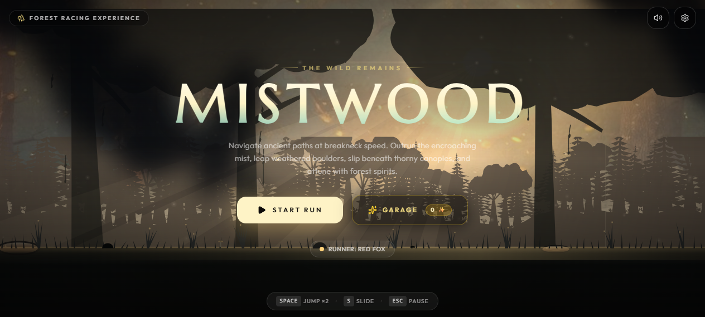

# 🌲 Mistwood — An Endless Forest Run
> *"The Wild Remains. Navigate ancient paths at breakneck speed, outrun the encroaching mist, leap weathered boulders, slip beneath thorny canopies, and attune with forest spirits."*


---

## 📸 Homepage Preview



---

## 🎮 Game Overview

**Mistwood** is a high-speed, atmospheric 2D side-scrolling endless forest runner and racing experience. Players embody majestic wild animals sprinting through an ancient enchanted forest. The environment dynamically transitions through day and night cycles while players dodge rocky outcroppings, slide beneath tangled thorn canopies, collect luminous firefly spirits, and push their reflexes to the limit.

Built from scratch using **React 19**, **TypeScript**, and a customized **HTML5 Canvas 2D procedural rendering engine**, Mistwood pairs physics-driven quadruped animation with procedural sound synthesis and cross-platform mobile support via **Capacitor**.

---

## ✨ Key Features

### 🌅 Procedural Atmosphere & Time-of-Day Cycles
- **Seamless Biome Keyframes**: Transitions fluidly through four distinct segments:
  - 🌅 **Golden Dawn**: *"First light through the pines"*
  - ☀️ **Quiet Midday**: *"The forest holds its breath"*
  - 🌄 **Violet Dusk**: *"Shadows stretch and wander"*
  - 🌌 **Firefly Night**: *"Follow the little lights"*
- **Volumetric Lighting**: Procedural god rays that cast dynamically through dense tree canopies.
- **Parallax Silhouette Landscapes**: Multi-layered background silhouettes, swaying foliage, wind motes, falling leaves, and drifting mist.

### 🐾 Anatomical Quadruped Animation Engine
- Real-time procedural skeletal and muscle deformation including:
  - Dynamic gait frequency and stride scaling linked directly to velocity.
  - Landing squash and spring recovery with camera shake.
  - Aerodynamic pitch rotation during mid-air leaps and double-jump front flips.
  - Low-profile sliding poses to slip beneath low-hanging hazards.

### ⚡ Reflex-Driven Hazard & Scoring Systems
- **Hazard Variety**: Boulder fields, mossy fallen logs, thorny brambles, ancient tree stumps, and suspended canopy vines.
- **Near-Miss Multiplier**: Grazing obstacles at high speed without collision rewards near-miss bonus points and pulse feedback.
- **Speed Streak Engine**: Accelerate up to breakneck velocities (over 100+ km/h) with speed streak visual trails and high-octane camera FOV zooms.
- **Ghost Distance Markers & Best Score Tracking**: Real-time HUD showing distance (m), velocity (km/h), firefly counts, and personal best markers.

### 🎵 Procedural Web Audio Synthesis
- Zero heavy audio files: sound effects and ambient drone music are synthesized entirely in real-time using the **Web Audio API**.
- Footstep variations (soft loam, stone scuffs), atmospheric wind whistle, jump whooshes, collectible harmonic chimes, and impact thuds.

---

## 🦊 Playable Animals & Garage

Visit the **Garage** to unlock, inspect, and select different runners using collected Firefly Spirits (✨):

| Animal | Rarity | Speed | Agility | Jump | Power | Perk / Ability |
| :--- | :--- | :---: | :---: | :---: | :---: | :--- |
| **Red Fox** | Common | 8/10 | 9/10 | 7/10 | 4/10 | Instant acceleration, light-footed recovery |
| **Shiny Moon Fox** | Rare | 8/10 | 10/10 | 8/10 | 5/10 | Celestial low-gravity stride & crystalline wisp aura |
| **Forest Stag** | Epic | 9/10 | 7/10 | 9/10 | 6/10 | Long galloping stride & soaring high leaps |
| **Mountain Panda** | Epic | 6/10 | 5/10 | 6/10 | 9/10 | Heavy momentum, crushing low slides & stable footing |
| **Golden Lion** | Legendary | 9/10 | 7/10 | 8/10 | 10/10 | Explosive acceleration bursts & earth-shaking pounces |

### 🎨 Elemental Fox Pelts
- **Ember Fox**: Classic forest guardian with fiery footsteps.
- **Silver Moon**: Winter constellation frost-walker with blue crystalline shimmer.
- **Spirit Wisp**: Celestial ghost featuring translucent body and mystical motes.
- **Autumn Bramble**: Grove protector cloaked in golden sunburst embers.
- **Obsidian Void**: Violet-infused shadow of the ancient pines.


### Mobile & Touchscreen
- **Tap Screen**: Jump (Tap again in mid-air for Double Jump)
- **Swipe Down / Hold**: Slide under obstacles
- **On-Screen HUD**: Dedicated pause and audio buttons; landscape-optimized interface with Capacitor native orientation locking.

---

## 📁 Project Structure

```text
MistWood/
├── android/                         # Capacitor native Android project configuration
├── dist/                            # Production build output (bundled single-file web app)
├── public/                          # Static assets and PWA manifests
│   ├── icons/                       # App icons and SVG vectors
│   ├── images/                      # Atmospheric background textures (forest-dawn, forest-dusk)
│   ├── manifest.webmanifest         # Progressive Web App manifest
│   └── sw.js                        # Service worker for offline caching
├── screenshots/                     # Project screenshots & media
│   └── homepage.png                 # Main menu / Home page screenshot
├── src/
│   ├── components/                  # React UI components
│   │   ├── MistwoodGame.tsx         # Top-level game state manager & canvas lifecycle
│   │   └── ui/                      # HUD and overlay components
│   │       ├── FoxPreviewCanvas.tsx # Interactive 3D/2D rotating animal preview in Garage
│   │       ├── GameHUD.tsx          # Real-time speedometer, distance, biome progress & health
│   │       ├── Garage.tsx           # Animal & pelt selection, stat radar, unlock shop
│   │       ├── Garage2DView.tsx     # 2D preview canvas for quadruped runners
│   │       ├── MainMenu.tsx         # Atmospheric title screen with start & garage triggers
│   │       ├── OrientationPrompt.tsx# Landscape orientation helper for mobile devices
│   │       ├── PauseMenu.tsx        # In-game pause modal and resume/restart options
│   │       ├── ResultsScreen.tsx    # Run summary, high score records & firefly collection
│   │       ├── SettingsModal.tsx    # Graphics, volume sliders, screen shake & controls config
│   │       ├── Speedometer.tsx      # Analog & digital racing velocity gauge
│   │       └── ToastNotification.tsx# Real-time achievement and biome alerts
│   ├── game/                        # Core game engine & procedural physics
│   │   ├── Animal2D.ts              # Procedural 2D quadruped anatomy rendering & animation
│   │   ├── animals.ts               # Animal profiles, mass, stride lengths, hitboxes & stats
│   │   ├── audio.ts                 # Real-time Web Audio API procedural synthesizer
│   │   ├── engine.ts                # Main game loop, delta-time updater, collision detection
│   │   ├── particles.ts             # Spark, leaf, dust, landing, and speed streak particles
│   │   ├── player.ts                # Quadruped kinematic controller, jumping & sliding physics
│   │   ├── types.ts                 # TypeScript interfaces, color palettes & math utilities
│   │   └── world.ts                 # Procedural level generator, parallax silhouettes & god rays
│   ├── utils/                       # Utility helpers
│   │   └── haptics.ts               # Capacitor vibration and mobile haptics integration
│   ├── App.tsx                      # Root application entry
│   ├── index.css                    # Tailwind CSS v4 directives & cinematic styling
│   └── main.tsx                     # React DOM initialization
├── capacitor.config.ts              # Capacitor mobile runtime configuration
├── index.html                       # HTML5 entry point with preconnect Google Fonts
├── package.json                     # Project dependencies & build scripts
├── tsconfig.json                    # TypeScript compiler options
└── vite.config.ts                   # Vite configuration with React, Tailwind & singlefile plugins
```

---

## 🛠️ Technology Stack

- **Core Framework**: [React 19](https://react.dev/)
- **Programming Language**: [TypeScript 5.9](https://www.typescriptlang.org/)
- **Bundler & Build Tool**: [Vite 7](https://vite.dev/)
- **Styling**: [Tailwind CSS 4](https://tailwindcss.com/)
- **Icons**: [Lucide React](https://lucide.dev/)
- **Rendering**: HTML5 Canvas 2D API (Procedural dynamic rendering)
- **Audio**: Web Audio API (Synthesizers, oscillators, dynamic filters)
- **Mobile Container**: [Capacitor 8](https://capacitorjs.com/) (`@capacitor/android`, `@capacitor/haptics`, `@capacitor/screen-orientation`)

---

## 🚀 Getting Started

### Prerequisites
- [Node.js](https://nodejs.org/) (Version 18.0 or higher recommended)
- `npm` or `yarn` package manager

### Installation
1. Clone or navigate to the repository directory:
   ```bash
   cd MistWood
   ```
2. Install dependencies:
   ```bash
   npm install
   ```

### Running Locally (Development Mode)
Start the Vite local development server:
```bash
npm run dev
```
Open your browser and navigate to the local address provided (typically `http://localhost:5173`).

### Building for Production
Create an optimized production bundle:
```bash
npm run build
```
The output will be placed in the `dist/` directory as an inlined single-file web application.

To preview the production build locally:
```bash
npm run preview
```

### Android Native Workflow (Capacitor)
```bash
# Build web assets and sync to native Android project
npm run android:build

# Sync web assets to Android
npm run android:sync

# Open the project in Android Studio
npm run android:open
```


## 👤 Author Information

- **Author**: **Saif Al Saad**
- **Discipline**: **Software Engineering**
- **Specialization**: **Major in SQA (Software Quality Assurance)**
- **Institution**: **Daffodil International University (DIU)**

---

## 📄 License
This project is developed for educational, demonstration, and gaming entertainment purposes. All rights reserved by the author.
